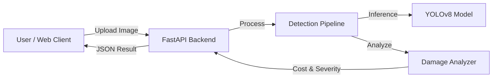

# Vehicle Damage Detection System

[](README.md)
[](README.en.md)

**Automated AI system for vehicle damage assessment and cost estimation.**

[](https://opensource.org/licenses/MIT)
[](https://www.python.org/downloads/)
[](https://www.docker.com/)
[](https://github.com/ultralytics/ultralytics)

---

## Demo Results

See the system in action. The AI detects damages like scratches and dents, classifies severity, and estimates repair costs.

| Scratch Detection |
|-------------------|
|  |

---

## Features

- **AI Damage Detection**: Uses YOLOv8 to identify scratches, dents, broken glass, and more.
- **Smart Cost Estimator**: Automatically calculates repair cost ranges based on damage type and severity.
- **Severity Analysis**: Classifies damage as Minor, Moderate, or Severe.
- **Fast Processing**: Optimized pipeline processes images in <1 second.
- **Modern Web Interface**: React + TypeScript SPA for easy user interaction.
- **Docker Ready**: Full containerization for easy deployment.

---

## Quick Start

### Option 1: Docker (Recommended)

Get the full system (Backend + Frontend) running in minutes.

```bash
# Clone repository
git clone https://github.com/yourusername/vehicle-damage-detection.git
cd vehicle-damage-detection

# Start system
docker-compose up --build
```

- **Web UI**: [http://localhost:3000](http://localhost:3000)
- **API Docs**: [http://localhost:8000/docs](http://localhost:8000/docs)

### Option 2: CLI Demo (No Docker required)

Want to test the AI logic quickly? Use the CLI tool.

```bash
# Install dependencies
pip install -r requirements.txt

# Run demo on a sample image
python demo.py --image data/test_samples/real_damage.jpg --simulate
```

---

## Architecture

The system is built as a microservices-ready MVP:



- **Backend**: Python, FastAPI, OpenCV, Ultralytics YOLO
- **Frontend**: React, TypeScript, Vite, Material UI
- **Deployment**: Docker Compose

---

## Project Structure

```
vehicle-damage-detection/
├── assets/             # Demo assets and screenshots
├── data/               # Test data and samples
├── docs/               # Documentation and archives
├── models/             # AI Model weights
├── scripts/            # Utility scripts (download, setup)
├── src/                # Backend source code
│   ├── api/            # FastAPI application
│   ├── models/         # AI & Analysis logic
│   └── utils/          # Helpers
├── web/                # Frontend source code
├── demo.py             # CLI Entry point
├── docker-compose.yml  # Production deployment
└── README.md           # This file
```
