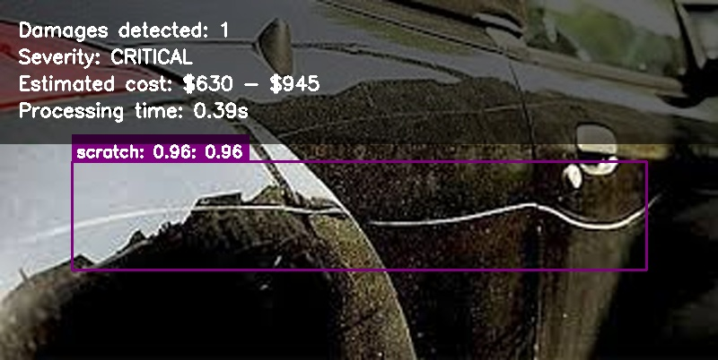
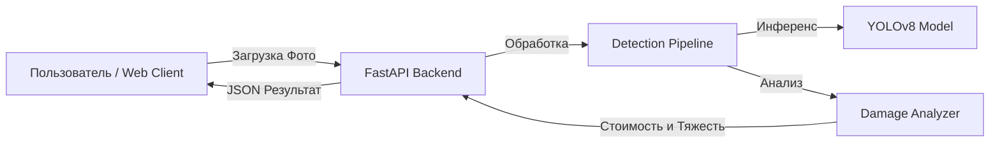

# Vehicle Damage Detection System

[](README.md)
[](README.en.md)

**Автоматизированная AI система для оценки повреждений автомобиля и расчета стоимости ремонта.**

[](https://opensource.org/licenses/MIT)
[](https://www.python.org/downloads/)
[](https://www.docker.com/)
[](https://github.com/ultralytics/ultralytics)

---

## Результаты Демонстрации

Система в действии. ИИ обнаруживает повреждения (царапины, вмятины), классифицирует степень тяжести и оценивает стоимость ремонта.

| Детекция Царапины (Scratch) |
|---------------------------|
|  |

---

## Возможности

- **AI Детекция Повреждений**: Использует YOLOv8 для обнаружения царапин, вмятин, разбитого стекла и др.
- **Умная Оценка Стоимости**: Автоматически рассчитывает диапазон стоимости ремонта на основе типа повреждения и серьезности.
- **Анализ Тяжести**: Классифицирует повреждения как Незначительные, Средние или Серьезные.
- **Быстрая Обработка**: Оптимизированный пайплайн обрабатывает изображения менее чем за 1 секунду.
- **Современный Веб-интерфейс**: React + TypeScript SPA для удобного взаимодействия.
- **Готовность к Docker**: Полная контейнеризация для легкого развертывания.

---

## Быстрый Старт

### Вариант 1: Docker (Рекомендуется)

Запуск полной системы (Backend + Frontend) за пару минут.

```bash
# Клонировать репозиторий
git clone https://github.com/yourusername/vehicle-damage-detection.git
cd vehicle-damage-detection

# Запустить систему
docker-compose up --build
```

- **Web UI**: [http://localhost:3000](http://localhost:3000)
- **API Docs**: [http://localhost:8000/docs](http://localhost:8000/docs)

### Вариант 2: CLI Демо (Без Docker)

Хотите быстро протестировать логику ИИ? Используйте CLI инструмент.

```bash
# Установка зависимостей
pip install -r requirements.txt

# Запуск демо на тестовом изображении
python demo.py --image data/test_samples/real_damage.jpg --simulate
```

---

## Архитектура

Система построена как MVP, готовый к микросервисной архитектуре:



- **Backend**: Python, FastAPI, OpenCV, Ultralytics YOLO
- **Frontend**: React, TypeScript, Vite, Material UI
- **Deployment**: Docker Compose

---

## Структура Проекта

```
vehicle-damage-detection/
├── assets/             # Демо-материалы и скриншоты
├── data/               # Тестовые данные и примеры
├── docs/               # Документация и архивы
├── models/             # Веса AI моделей
├── scripts/            # Скрипты утилит (загрузка, настройка)
├── src/                # Исходный код Backend
│   ├── api/            # FastAPI приложение
│   ├── models/         # Логика AI и анализа
│   └── utils/          # Вспомогательные модули
├── web/                # Исходный код Frontend
├── demo.py             # Точка входа CLI
├── docker-compose.yml  # Production развертывание
└── README.md           # Этот файл
```
